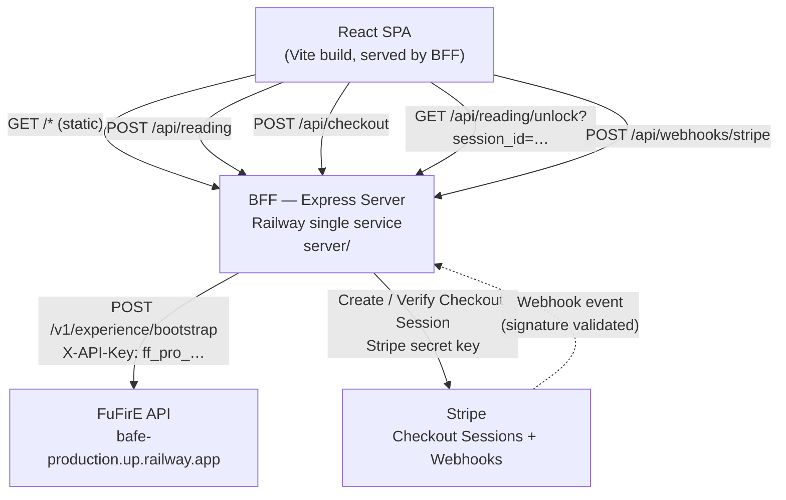
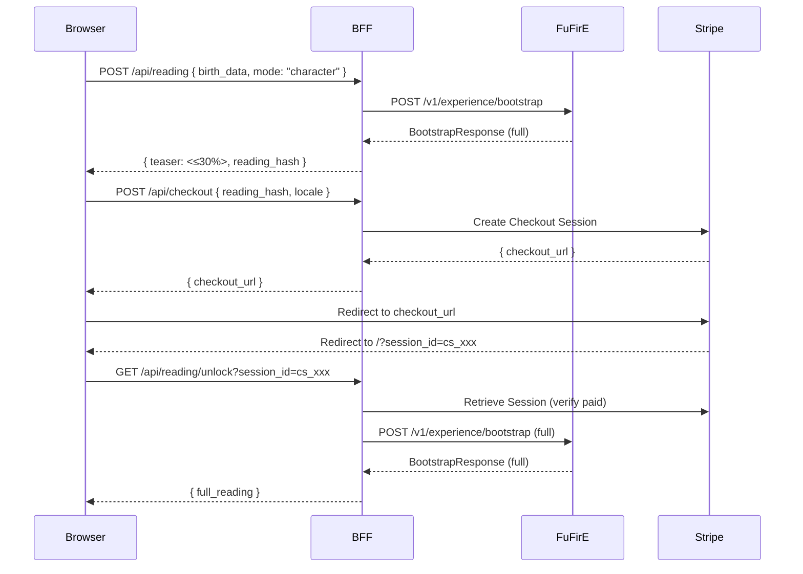

# Architecture: Bazodiac Landing Page

**Last updated**: 2026-04-14

## Overview

Bazodiac is a single-page scroll-driven marketing and conversion app. The architecture is a **single-service BFF monolith** deployed on Railway: one Node.js/Express server that serves the Vite-built React SPA as static files and exposes a thin backend-for-frontend (BFF) API layer.

This design satisfies:
- `REQ-MNT-railway-deploy` — single Railway service, no extra infrastructure
- `REQ-SEC-data-protection` — FuFirE API key and Stripe secret key stay server-side, never in the JS bundle
- `CON-railway-deployment` — single deployable unit, Nixpacks-detectable
- `CON-launch-deadline` — minimal infrastructure reduces operational complexity for the 2-week window

---

## System Diagram

---

## Components

### React SPA (`src/`)

**Responsibility**: All client-side rendering, user interaction, animations, and i18n.

Implemented as the existing Vite + React 19 + TypeScript application. No secrets. Communicates with the BFF exclusively via `fetch` on relative paths (`/api/…`).

Key client responsibilities:
- Scroll-driven GSAP ScrollTrigger animations (REQ-USA-scroll-animations)
- Birth date/time input form — single and partnership modes (REQ-F-birth-data-input)
- Teaser display → paywall gate → full reading display (REQ-F-teaser-preview, REQ-F-reading-unlock)
- i18n with locale detection and manual toggle, DE + EN (REQ-F-i18n)
- Cookie consent banner with granular control (REQ-COMP-cookie-banner)
- Responsive layout 320px–2560px (REQ-USA-responsive-layout)
- Legal pages: Impressum, Datenschutzerklärung (REQ-COMP-impressum, REQ-COMP-privacy-policy)

### BFF Server (`server/`)

**Responsibility**: Secret management, FuFirE proxy, Stripe integration, static file serving.

A lightweight Express server co-deployed with the React build. Holds all secrets via Railway environment variables. No business logic beyond orchestrating external APIs and enforcing the teaser/paywall boundary server-side.

Routes:
- `POST /api/reading` → calls FuFirE `/v1/experience/bootstrap` (once for character, twice for partnership), strips response to ≤30% teaser, returns `{ teaser, reading_hash }` (REQ-F-reading-generation, REQ-F-teaser-preview)
- `POST /api/checkout` → creates Stripe Checkout Session, returns `{ checkout_url }` (REQ-F-payment-integration)
- `GET /api/reading/unlock` → verifies Stripe `session_id`, calls FuFirE again for full reading, returns `{ full_reading }` (REQ-F-reading-unlock)
- `POST /api/webhooks/stripe` → validates Stripe webhook signature, acknowledges event (REQ-SEC-data-protection)
- `GET /*` → serves `dist/` (Vite production build)

### FuFirE API (external)

**Base URL**: `https://bafe-production.up.railway.app`

**Primary endpoint**: `POST /v1/experience/bootstrap`

Provides the tri-system astrology calculation: Western zodiac, BaZi (Four Pillars), Wu-Xing element fusion. The response includes a full profile with soulprint sectors and signature blueprint — this is the "full reading."

**Partnership readings**: FuFirE has no dedicated compatibility endpoint. The BFF calls bootstrap for person A and person B separately, then merges the two profiles into a partnership response. Consumes 2× rate limit per partnership reading.

Authentication: `X-API-Key: ff_pro_<secret>` injected by BFF only.

### Stripe (external)

Handles all payment processing. The BFF creates a Checkout Session (hosted payment page); on success, Stripe redirects the user back to the SPA with a `session_id` query parameter. The BFF validates this session before unlocking the full reading.

Webhook endpoint (`POST /api/webhooks/stripe`) provides a secondary confirmation path and is validated via `stripe.webhooks.constructEvent` before acting on any payload.

---

## Request Flows

### Character Reading Flow

### Partnership Reading Flow

Same as above, except `POST /api/reading` includes `partner_birth_data` and the BFF makes two FuFirE bootstrap calls, merging the results before responding.

---

## Environment Variables

All secrets injected via Railway environment variables (REQ-MNT-railway-deploy, REQ-SEC-data-protection):

| Variable | Used by | Description |
|----------|---------|-------------|
| `FUFIRE_API_KEY` | BFF | `ff_pro_<secret>` — FuFirE API key |
| `FUFIRE_BASE_URL` | BFF | `https://bafe-production.up.railway.app` |
| `STRIPE_SECRET_KEY` | BFF | Stripe secret key (server-side only) |
| `STRIPE_WEBHOOK_SECRET` | BFF | Stripe webhook signing secret |
| `STRIPE_PRICE_ID` | BFF | Stripe Price ID for the reading product |
| `PUBLIC_URL` | BFF | Deployed URL for Stripe success/cancel redirect |
| `VITE_STRIPE_PUBLISHABLE_KEY` | SPA build | Stripe publishable key (safe for client) |

No secrets are embedded in the Vite build. `VITE_*` variables are only used for the Stripe publishable key, which is intentionally public.

---

## Performance Considerations

- **REQ-PERF-initial-load** (FCP < 3s on 4G): The Vite build produces a code-split bundle. The SPA shell renders immediately; reading results are loaded on demand after user interaction.
- **FuFirE latency**: bootstrap call is not on the critical rendering path — it is triggered by explicit user action (form submit). Acceptable to show a loading state.
- **Stripe redirect**: Stripe Checkout is a full-page redirect, not a modal. No additional frontend bundle overhead.
- **Rate limits**: `ff_pro_` tier supports 100 req/min, 10k/day. Partnership readings consume 2 req. Well within expected launch traffic.

---

## Security Boundaries

- **No PII in URLs**: `reading_hash` is a server-generated opaque token, not a birth date. (REQ-SEC-data-protection)
- **No PII in logs**: BFF log middleware must exclude request bodies for `/api/reading`. (REQ-SEC-data-protection)
- **HTTPS only**: Railway enforces TLS termination. No plaintext HTTP in any service-to-service call. (REQ-SEC-data-protection)
- **Stripe keys**: secret key never reaches the browser; publishable key is safe by design. (REQ-SEC-data-protection)
- **Webhook validation**: `stripe.webhooks.constructEvent` must be called before acting on any webhook payload. (REQ-SEC-data-protection)

---

## Relevant Decisions

| Decision | Summary |
|----------|---------|
| [DEC-bff-same-service](../decisions/DEC-bff-same-service.md) | Express BFF + SPA in one Railway service |
| [DEC-no-database](../decisions/DEC-no-database.md) | No persistent storage for MVP — readings generated fresh |
| [DEC-fufire-bootstrap](../decisions/DEC-fufire-bootstrap.md) | Use `/v1/experience/bootstrap` as primary reading endpoint |
| [DEC-teaser-server-strip](../decisions/DEC-teaser-server-strip.md) | Teaser created server-side by stripping full reading |
