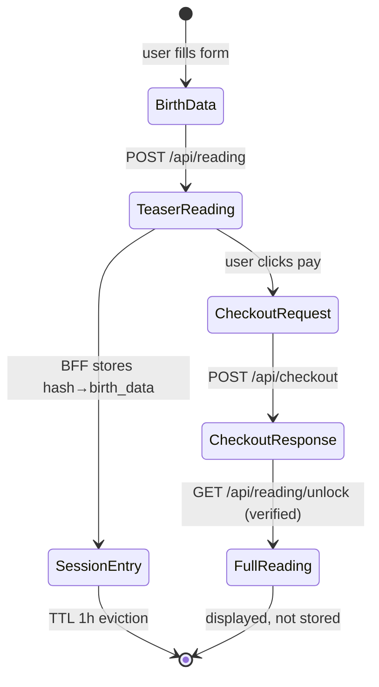

# Data Model: Bazodiac Landing Page

**Last updated**: 2026-04-14

## Overview

There is no database. All types are TypeScript interfaces shared between the BFF (`server/`) and the SPA (`src/`). The only runtime state is a module-level in-memory `Map` in the BFF for short-lived checkout sessions (see [DEC-no-database](../decisions/DEC-no-database.md)).

Types are organized into four groups:
1. **Input** — user-supplied birth data
2. **Reading** — FuFirE response mapped to app types (teaser and full variants)
3. **Session** — BFF-only in-memory session store
4. **Checkout** — Stripe session request/response

---

## 1. Input Types

```ts
/**
 * User-supplied birth information.
 * Used within a single request cycle only — never persisted or logged.
 * REQ-F-birth-data-input, REQ-SEC-data-protection
 */
interface BirthData {
  date: string;             // ISO 8601: "YYYY-MM-DD"
  time?: string;            // "HH:MM" (24h) — omitted when birth time is unknown
  birth_time_known: boolean; // sent to FuFirE — controls hour pillar calculation
  timezone: string;         // IANA timezone: e.g. "Europe/Berlin"
  lat?: number;             // decimal degrees — improves BaZi accuracy (optional)
  lon?: number;             // decimal degrees
}

/**
 * Body of POST /api/reading.
 * REQ-F-birth-data-input
 */
interface ReadingRequest {
  mode: "character" | "partnership";
  birth_data: BirthData;
  partner_birth_data?: BirthData; // required when mode = "partnership"
}
```

---

## 2. Reading Types

### Teaser Reading (≤30% of full — returned by `POST /api/reading`)

The teaser is constructed server-side from the FuFirE bootstrap response.
Full reading data is never included. See [DEC-teaser-server-strip](../decisions/DEC-teaser-server-strip.md).

```ts
/**
 * REQ-F-teaser-preview: at most 30% of the full reading content.
 */
interface TeaserReading {
  mode: "character" | "partnership";
  subject: PersonTeaser;
  partner?: PersonTeaser; // present when mode = "partnership"
}

interface PersonTeaser {
  sun_sign: string;            // e.g. "Scorpio"
  chinese_year_animal: string; // e.g. "Year of the Dragon"
  nakshatra: string;           // e.g. "Rohini"
  element_summary: string;     // e.g. "Fire dominant (64%)"
  preview_text: string;        // one-paragraph teaser narrative from bootstrap
}
```

### Full Reading (returned by `GET /api/reading/unlock` after verified payment)

```ts
/**
 * REQ-F-reading-generation, REQ-F-reading-unlock
 * Mapped from FuFirE POST /v1/experience/bootstrap BootstrapResponse.
 */
interface FullReading {
  mode: "character" | "partnership";
  subject: PersonProfile;
  partner?: PersonProfile; // present when mode = "partnership"
}

interface PersonProfile {
  // Western astrology
  sun_sign: string;
  moon_sign: string;
  ascendant: string;
  dominant_planets: string[];

  // BaZi (Four Pillars of Destiny)
  four_pillars: FourPillars;
  day_master: string;          // e.g. "Yang Wood"
  element_balance: ElementBalance;

  // Vedic / Nakshatra
  nakshatra: string;           // birth star
  nakshatra_lord: string;      // ruling planet

  // Tri-system fusion narrative
  soulprint_sectors: SoulprintSector[];
  signature_blueprint: string; // full narrative — the core product text
}

interface FourPillars {
  year:  { stem: string; branch: string; animal: string };
  month: { stem: string; branch: string };
  day:   { stem: string; branch: string };
  hour?: { stem: string; branch: string }; // absent when birth_time_known = false
}

interface ElementBalance {
  wood:  number; // 0.0–1.0 (fractional share)
  fire:  number;
  earth: number;
  metal: number;
  water: number;
}

interface SoulprintSector {
  name:        string; // e.g. "Identity", "Relationships", "Purpose"
  score:       number; // 0–100
  description: string; // narrative paragraph for this sector
}
```

---

## 3. BFF Session Store

Server-side only. The `Map` is module-level in `server/`. Entries expire after 1 hour.
See [DEC-no-database](../decisions/DEC-no-database.md).

```ts
/**
 * Stored in BFF memory only — never sent to client.
 * Associates an opaque reading_hash with the birth data
 * needed to regenerate the full reading after payment.
 */
interface SessionEntry {
  reading_hash: string;           // crypto.randomUUID() — safe for URLs
  mode: "character" | "partnership";
  birth_data: BirthData;
  partner_birth_data?: BirthData;
  created_at: number;             // Date.now() — TTL eviction threshold: +3600000ms
}

// Module-level store in server/
// const sessions = new Map<string, SessionEntry>();
```

**TTL eviction**: on each write, sweep entries where `Date.now() - entry.created_at > 3_600_000`.

---

## 4. Checkout Types

```ts
/**
 * Body of POST /api/checkout.
 * REQ-F-payment-integration
 */
interface CheckoutRequest {
  reading_hash: string; // opaque token from POST /api/reading response
  locale: "de" | "en"; // used to set Stripe Checkout locale
}

/**
 * Response of POST /api/checkout.
 */
interface CheckoutResponse {
  checkout_url: string; // Stripe-hosted Checkout page URL
}
```

---

## Type Sharing

Types used by both BFF and SPA live in `src/types/reading.ts` (imported by the SPA) and re-exported or duplicated in `server/types.ts` (used by the BFF). There is no runtime sharing — types are compile-time only.

Types that are **BFF-only** (never sent to client):
- `SessionEntry`
- Raw `BootstrapResponse` from FuFirE (internal BFF type, not exported to SPA)

---

## Lifecycle Summary



---

## Requirement Coverage

| Requirement | Type(s) |
|-------------|---------|
| REQ-F-birth-data-input | `BirthData`, `ReadingRequest` |
| REQ-F-reading-generation | `FullReading`, `PersonProfile`, `FourPillars`, `ElementBalance`, `SoulprintSector` |
| REQ-F-teaser-preview | `TeaserReading`, `PersonTeaser` |
| REQ-F-payment-integration | `CheckoutRequest`, `CheckoutResponse` |
| REQ-F-reading-unlock | `SessionEntry` (hash → birth data mapping for regeneration) |
| REQ-F-i18n | `locale` field in `CheckoutRequest` |
| REQ-SEC-data-protection | `SessionEntry` is BFF-only; `reading_hash` is opaque; `BirthData` never in URLs |
